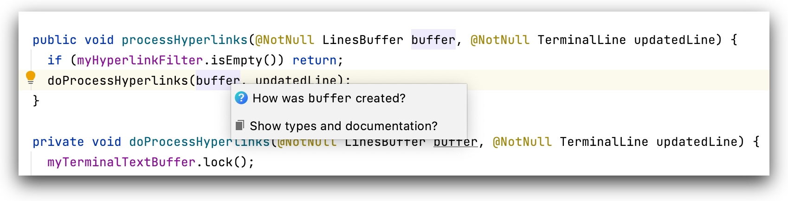
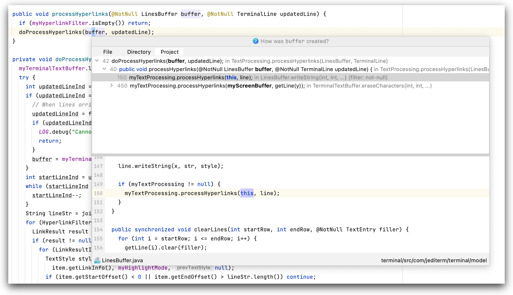

# reach-hover

<!-- Plugin description -->

`reach-hover` is a research plugin that is being developed at the [Software Practices Lab](https://spl.cs.ubc.ca) at
the [University of British Columbia](https://www.ubc.ca), Vancouver. It aims to make answering 
*[reachability questions](https://cs.gmu.edu/~tlatoza/papers/icse2010.pdf)* easier for software developers, and surface
information about them faster than conventional tools.

Currently, `reach-hover` supports two reachability questions, which are:

  * "How was this value (could be a variable, an object, etc...) created?"
  * "How is this value modified?"

The plugin presents these questions when a user hovers over a value of interest in code. `reach-hover` currently has
full support for Java, while support for Kotlin and other languages is 
[in progress](https://github.com/jyoo980/reach-hover/pull/30).

<!-- Plugin description end -->

## Screenshots

Hovering over an element of interest will invoke a popup dialogue with the option to investigate it further in the 
context of a reachability question.

Selecting the question of interest will bring up an exploratory popup where a user is able to trace the dataflow to
the element under inspection.

## Installation

Please note that this tool is a **research prototype**. Bugs are to be expected,
but feel free to file an issue for me to look at.

### From the JetBrains Marketplace

`reach-hover` can be downloaded from the [JetBrains Plugin Marketplace](https://plugins.jetbrains.com/plugin/18950-reach-hover).

### From source

TODO

---
Plugin based on the [IntelliJ Platform Plugin Template][template].

[template]: https://github.com/JetBrains/intellij-platform-plugin-template
